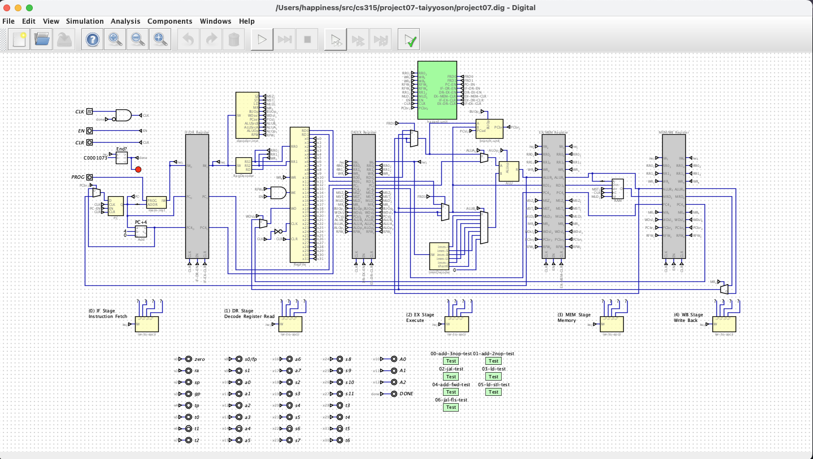

# Pipelined RISC-V Processor



A 5-stage pipelined RISC-V processor built in a digital logic simulator. The
design executes RISC-V instructions across overlapping pipeline stages and
includes a hazard unit that resolves data and control hazards automatically —
no manually inserted `nop` instructions required.

**Note**: The lack of modularity is due to no support for modularity in the Digital software, what was used to build the processor.

## Architecture

```
  IF        ID        EX        MEM       WB
 ┌────┐   ┌────┐   ┌────┐   ┌────┐   ┌────┐
 │Inst│──▶│Dec │──▶│ ALU│──▶│ Mem│──▶│ Reg│
 │Fetch│  │+ RF│   │+Br │   │ R/W│   │Write│
 └────┘   └────┘   └────┘   └────┘   └────┘
    ▲        ▲        ▲
    │        │        │
    └────────┴────────┴──── Hazard Unit (stall / forward / flush)
[generated w/ AI]
```


## Components

- **Register file** — 32 general-purpose registers
- **ALU** — arithmetic and logic operations driven by the control unit
- **Branch unit** — evaluates branch conditions and computes target addresses
- **Load/store memory subsystem** — RAM component with read/write
  support
- **Hazard unit** — forwarding, stall, and flush control across the pipeline

## Testing

The design was validated against three progressive test suites, each targeting
a specific hazard class:

1. **Arithmetic / forwarding** — back-to-back dependent ALU instructions.
2. **Load-use stalling** — a load immediately followed by a dependent use.
3. **Control-hazard flushing** — branches that redirect the instruction stream.

## Tooling

- **ISA:** RISC-V
- **Built in:** a digital logic / circuit simulator (`.dig` schematic format)
- **Top-level module:** `main.dig`
